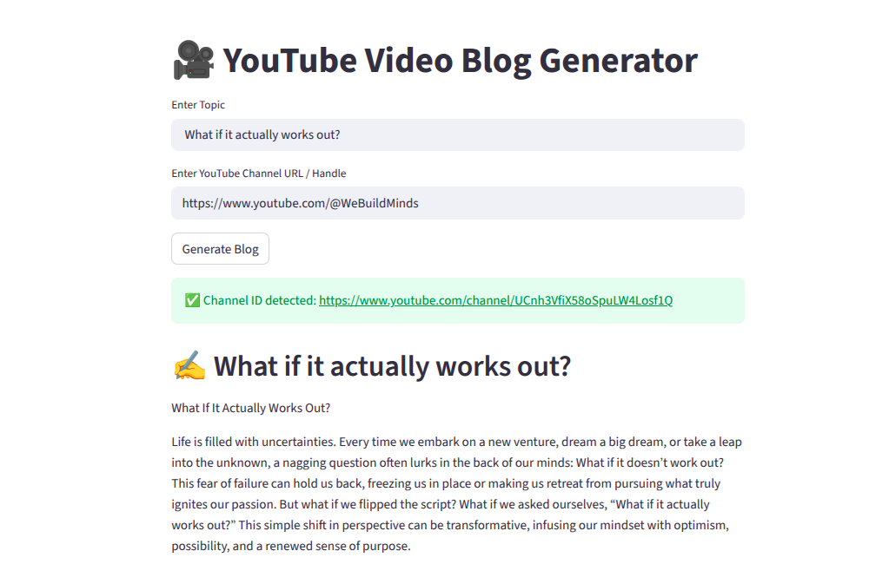

# 🎥 AutoBlog AI

Convert YouTube videos into structured, readable blogs using AI.


## 🚀 Features

- 🔗 Input a YouTube Channel URL and Video Title  
- 🧠 Extracts video transcript  
- ✍️ Generates a well-structured blog  
- ⚡ Powered by CrewAI + OpenAI  

---

## 🛠️ Tech Stack

- Streamlit  
- CrewAI  
- OpenAI (GPT-4o)  
- YouTube Transcript API  

---

## ▶️ How to Run

```bash
git clone <your-repo-url>
cd <project-folder>
pip install -r requirements.txt
streamlit run app.py
